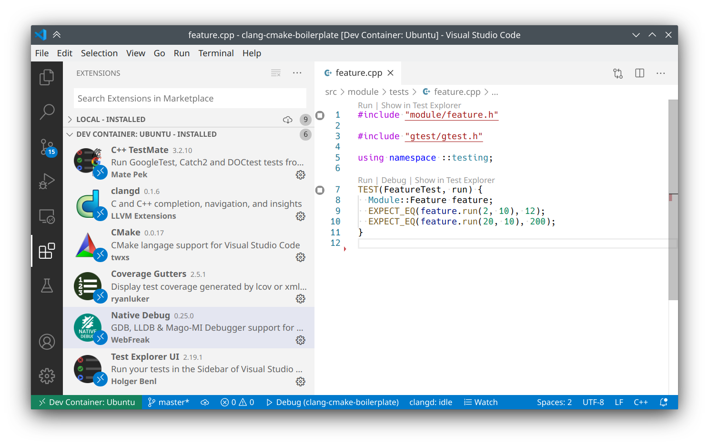
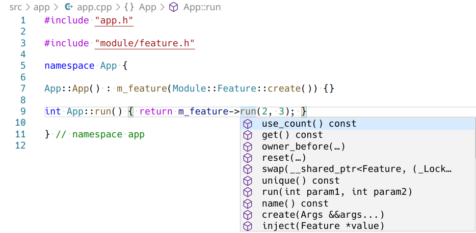
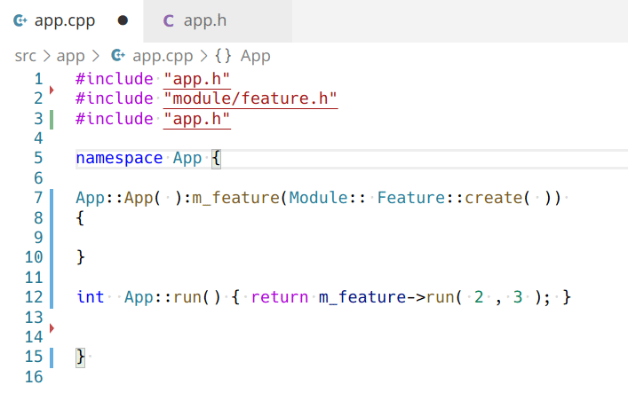
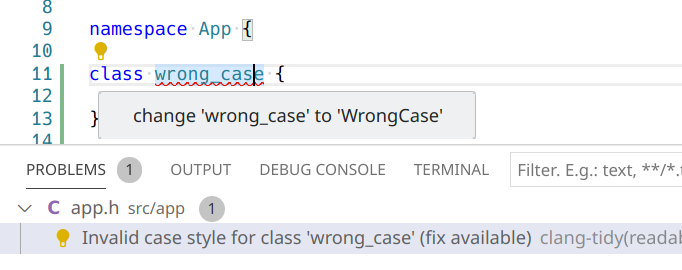
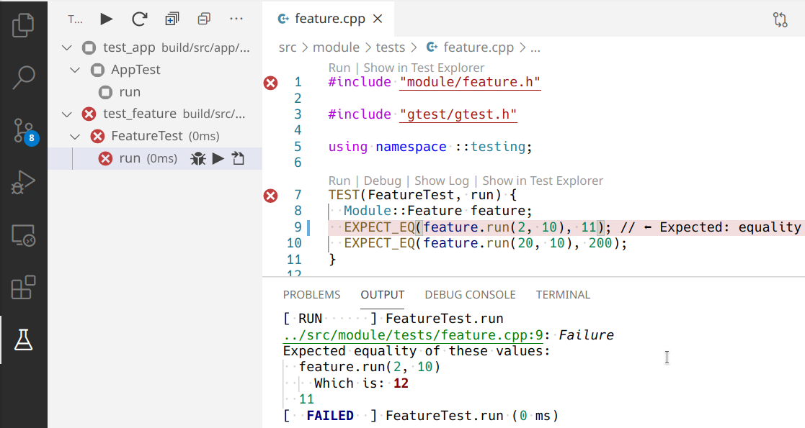
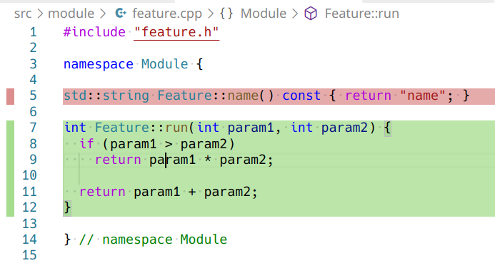
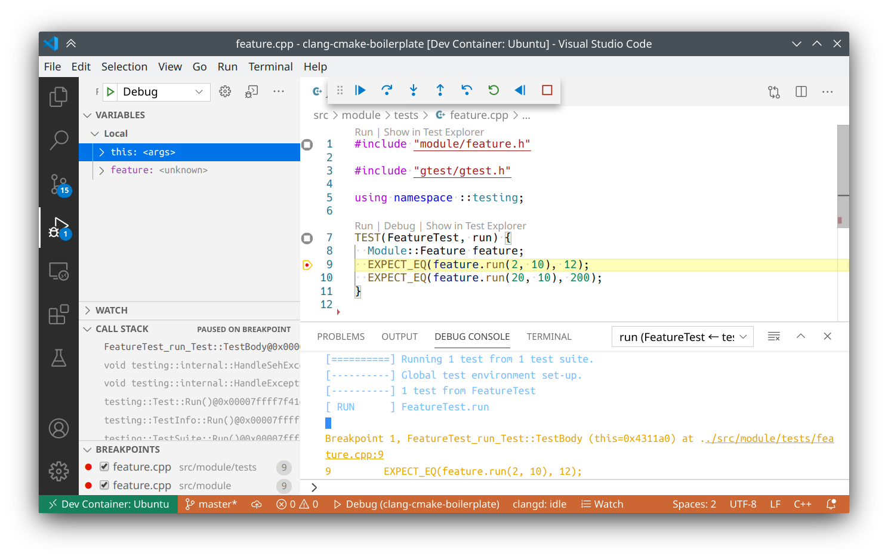

# cpp-boilerplate

Quick setup for a new C++ project in Visual Studio Code.

> **Linux only. It was created and tested on Ubuntu 18.04**

# How to use

* Install [Visual Studio Code](https://code.visualstudio.com/download)
* Install [Remote - Containers](https://marketplace.visualstudio.com/items?itemName=ms-vscode-remote.remote-containers) extension
* Clone this project and open in VS Code
* In Command Palette find and click on the **Remote-Containers: Reopen in Container**
* Build project with **Tasks: Run build task** command
* Restart clangd with **Restart the clangd language server** command if it cannot find include files

# Features

## VS Code integration

### [Remote - Containers](https://code.visualstudio.com/docs/remote/containers)

Compiler and other tools are installed inside the container. VS Code with plugins is the only thing that needs to be installed on the host machine.

Ubuntu 20.04 is used in the container, [settings](.devcontainer/devcontainer.json), [Dockerfile](docker/Dockerfile). X11 applications can be run from the container even with OpenGL acceleration

### [Visual Studio Code extension for clangd](https://github.com/clangd/vscode-clangd)

* Code completion

* Format on save with clang-format

  *Format settings can be changed in [.clang-format](.clang-format) file*

* Linting and autofixes with clang-tidy

  *Linting settings can be changed in [.clang-tidy](.clang-tidy) file*

### [Google Test Adapter](https://github.com/matepek/vscode-catch2-test-adapter)

### [Code coverage](https://github.com/ryanluker/vscode-coverage-gutters)

*Code coverage is available only after running **Run all tests with code coverage** task*

### [Native Debug](https://github.com/WebFreak001/code-debug)

### Tasks

Project has following VS Code tasks:

* **Configure**. It performs cmake configuration
* **Build**. Default build task
* **Run all test**
* **Run all tests with code coverage**
* **Check format**. Runs `tools/check-format.sh`
* **Fix format**. Runs `tools/check-format.sh` with `--fix` option

## CMake

This project uses CMake 3.18 with additional scripts which can be found in the cmake folder.

* `clang-tidy.cmake` enables clang-tidy linter during building stage. Really useful on CI. Has options:
  * `CLANG_TIDY` - enable clang-tidy

  **It's not recommended  to enable while developing**.

* `coverage.cmake` adds compile options to export raw coverage data and coverage target that runs all tests, collects coverage counters and exports in text, lcov and html formats. Uses llvm-cov and llvm-profdata. Has options:
  * `COVERAGE` - enable coverage
  * `COVERAGE_TEXT` - show text summary
  * `COVERAGE_LCOV` - export in lcov format (build/coverage/lcov.info)
  * `COVERAGE_HTML` - export in html format (build/coverage/html)

  **All targets in project have to be added to coverage explicitly with `add_coverage()` function**

* `tests.cmake` enables Google Test framework and adds some functions. Options:
  * `TESTS` - enable tests building
  * `TESTS_BUNARY_PREFIX` - test binary prefix
  * `TESTS_RUN_TIMEOUT` - test running timeout
  * `TESTS_PARALLEL` - how many tests can be run in parallel

Functions:
  * `add_unit_test(<name> source1 [source2 ...] [LIBS lib1 [lib2 ...]])` - creates test binary target, adds gtest_main and test discovery. name is a test binary name with TESTS_BUNARY_PREFIX prefix. LIBS are additional library targets
  * `add_mocks(<name> source1 [source2 ...] [LIBS lib1 [lib2 ...]])` - creates mock shared library and links gmock to it, name is a library name. LIBS are additional library targets

## Additional scripts

* `tools/ci-test.sh` - builds project with all the checks and code coverage
* `tools/ci-release.sh` - builds project without code coverage
* `tools/check-format.sh` - checks code format in all source files
